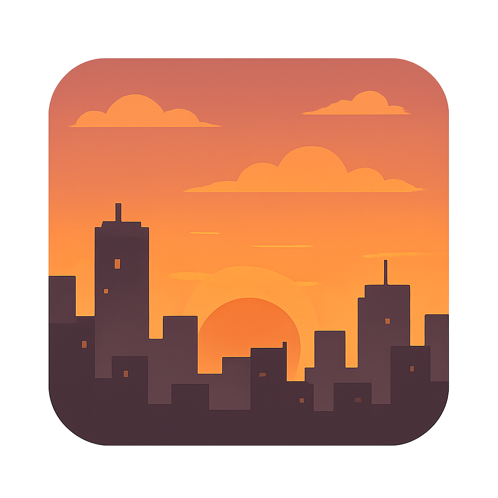
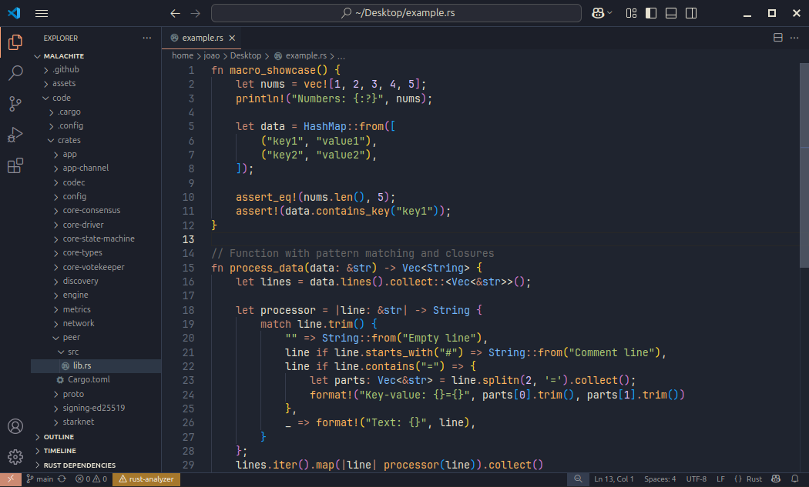
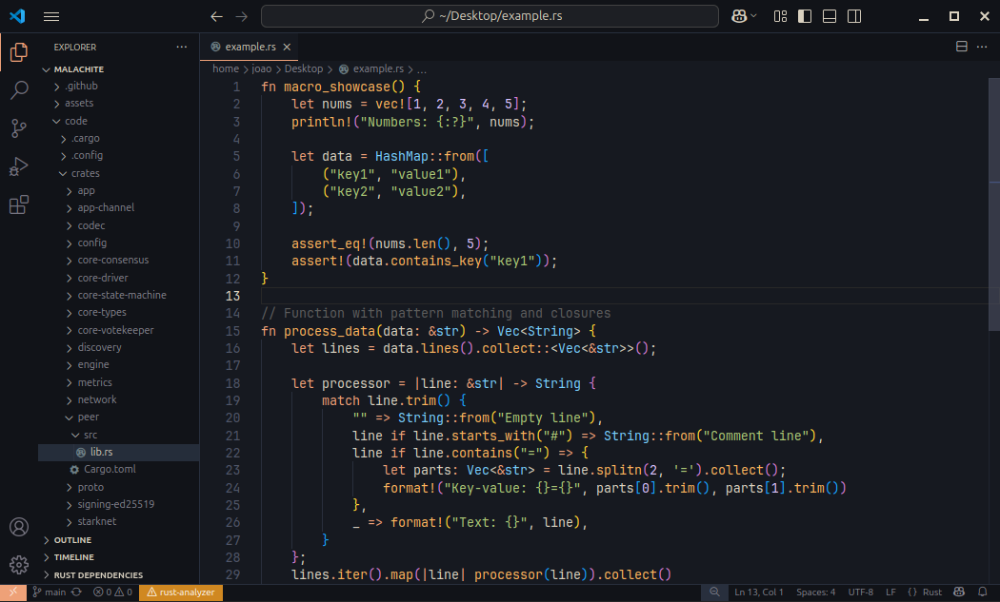

<p align="center">
  
</p>

# Ayu Evening - VS Code Theme


A warm sunset-inspired color theme for VS Code based on the Ayu color palette with hints of Gruvbox dark.

## Description

Ayu Evening is a color theme that combines the elegant aesthetics of Ayu Mirage with the warmth of sunset colors and some inspiration from Gruvbox. The goal of this theme is to offer a comfortable coding experience by using balanced contrast and a warm color palette.

### Why?

I created this theme primarily out of security concerns with third-party VSCode extensions. The recent security incidents associated with extensions, particulary the one involving the Material Theme, highlighted the risks associated with trusting third-party extensions, regardless if they are widely used.

I felt uncomfortable continuing to use third-party themes that could potentially be compromised. Color themes should be simple, static resources that don't need broad system access or connections to external servers.

This entire theme consists of static JSON files that define colors and syntax highlighting rules, nothing more. You can review the entire codebase in minutes to verify this for yourself.

## Features

- **Two theme variants:**
  - **Ayu Evening**: A balanced dark theme with warm orange and blue accents
  - **Ayu Evening Dark**: A deeper, darker variant with the same warm color scheme

- **Optimized for multiple languages:**
  - Rust
  - Python
  - JavaScript
  - Go
  - C/C++
  - Bash/Shell
  - HTML/CSS
  - And more...

## Screenshots

### Ayu Evening


### Ayu Evening Dark



## 📥 Installation

### Installing from GitHub

1. Clone this repository
```bash
git clone https://github.com/joaotav/ayu-evening-vscode-theme.git
```

2. Copy the folder to your VS Code extensions directory:
   - **Windows**: `%USERPROFILE%\.vscode\extensions`
   - **macOS/Linux**: `~/.vscode/extensions`

3. Restart VS Code
4. Select the theme via **File > Preferences > Color Theme**

## Credits

This theme is inspired by:
- [Ayu](https://github.com/ayu-theme/vscode-ayu) theme palette
- [Gruvbox](https://github.com/morhetz/gruvbox) dark color scheme

## License

This theme is released under the MIT License. See the [LICENSE](LICENSE) file for details.

## Contributing

Contributions are welcome! Feel free to submit issues or pull requests.

---

**Enjoy coding in the warm glow of sunset! 🌅**
